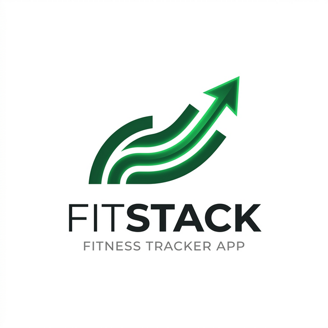

# FitStack



FitStack is a student-level React + Tailwind CSS project designed as a clean, modern, and simple fitness tracker. It features a subtle "liquid glass" UI effect and provides users with an easy way to log workouts, track progress, and view their history.

## 🌟 Features

- **Workout Logging**: Easily log your exercises, sets, reps, and weight.
- **Dynamic Stats**: Real-time progress tracking including Total Workouts, Total Sets, and Total Weight Lifted (Volume).
- **Persistent Storage**: All your workout data is securely saved in your browser's local storage.
- **Curated Exercise List**: A hand-picked selection of 50+ common gym exercises for a clean and relevant experience.
- **Responsive Design**: Mobile-first, "liquid glass" aesthetic that looks great on all devices.
- **History View**: Review all your past sessions at a glance.

## 🛠️ Tech Stack

- **Core**: React 18
- **Build Tool**: Vite
- **Styling**: Tailwind CSS
- **API**: [WGER Workout Manager](https://wger.de/en/software/api/) (Used for muscle group data and initial research)
- **Persistence**: Browser LocalStorage

## 🚀 How to Run Locally

### Prerequisites
- [Node.js](https://nodejs.org/) (Version 16 or higher)
- [npm](https://www.npmjs.com/) (usually comes with Node.js)

### Setup Instructions

1. **Clone the Repository**
   ```bash
   git clone https://github.com/SamHez/fitstack.git
   cd fitstack
   ```

2. **Install Dependencies**
   ```bash
   npm install
   ```

3. **Start the Development Server**
   ```bash
   npm run dev
   ```

4. **Open in Browser**
   Once the server is running, navigate to `http://localhost:5173` in your favorite web browser.

---
*Created as part of the ALX Frontend Capstone Project.*
